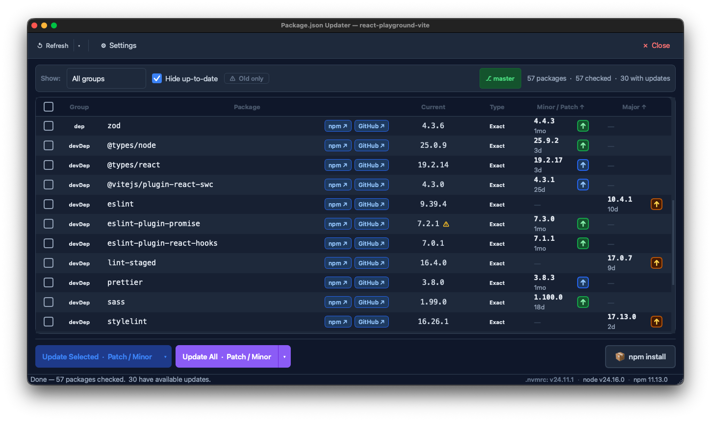

> **This project was fully generated with [Claude Code](https://claude.ai/code).**

# Package.json Updater

A desktop app for keeping your JavaScript dependencies up to date. It works with **npm, Yarn, pnpm, and Bun**. Open a `package.json`, see available patch / minor / major upgrades fetched live from the npm registry, and apply them in one click — without touching the terminal.



---

## Features

- **Three-column update view** — Patch, Minor, and Major upgrades shown side by side with the release age of each version
- **Constraint-type badge** — each row shows the version constraint type (Compatible `^`, Tilde `~`, Exact, Range, Wildcard, Local, Any)
- **Per-dependency update button** — click ↑ on any version to write that single change to disk immediately, no re-fetch required
- **Bulk updates** — select multiple packages with checkboxes (including a header _Select All_) and hit _Update Selected_, or use _Update All_ with a configurable scope (Patch & Minor only, or all levels including Major)
- **Package-manager aware** — detects npm / Yarn / pnpm / Bun from the project's lockfile, asks when several lockfiles are present, and lets you choose a manager per folder; every command-line action uses the right tool
- **Install** — run your project's install command (`npm install`, `yarn install`, `pnpm install`, or `bun install`) in the project directory from the toolbar; an in-app overlay streams the live output and reports success or failure
- **npm result cache** — fetched registry data is cached to disk with a configurable TTL so subsequent opens are instant; cache age is shown in the status bar
- **Hard refresh** — bypass the cache entirely and re-fetch all package data fresh from the registry
- **Version age filter** — hide versions published less than N days ago to avoid recently-yanked releases
- **Old version warning** — a ⚠ badge on the installed version when it has not been updated for longer than a configurable threshold (months or years); filter bar lets you show only flagged packages
- **Group filtering** — show only `dependencies`, `devDependencies`, or `overrides`
- **Hide up-to-date** — collapse rows that have no available upgrade
- **Merge Patch and Minor** — optional display setting that combines the Patch and Minor columns into one
- **Git integration** — current branch shown in the filter bar; a pull button appears when the working copy is behind the remote
- **Recent files** — start screen remembers the last opened projects with last-checked timestamps; scrollable when the list grows long
- **Light & dark theme** — toggle in the toolbar, persisted between sessions

---

## Usage

1. Click **Open Folder** or **Open package.json** on the start screen (or use `⌘O` / `Ctrl+O`)
2. The app fetches the latest versions for every dependency from the npm registry
3. Upgrades appear colour-coded by bump level — **blue** patch, **green** minor, **amber** major
4. Click the **↑** button in any cell to apply that single upgrade immediately
5. Or tick the checkboxes and click **Update Selected** / **Update All**
6. Click **📦 install** in the toolbar to install the written changes without leaving the app

### Settings

Open **⚙ Settings** in the toolbar to configure:

| Panel                   | Options                                                                             |
|-------------------------|-------------------------------------------------------------------------------------|
| **Theme**               | Light or dark                                                                       |
| **Version Age Filter**  | Only show versions published at least N days ago (default: 0 — no filter)           |
| **Old Version Warning** | Show ⚠ on packages not updated in N months/years (default: 12 months; 0 = disabled) |
| **Version Cache**       | Cache TTL (default: 24 h; 0 = always fetch live) and _Clear Cache Now_              |
| **Display**             | Merge Patch and Minor columns into one                                              |
| **Package Managers**    | Default package manager, and per-folder overrides you can remove                    |
| **About**               | App version                                                                         |

---

## Package managers

The app supports **npm, Yarn, pnpm, and Bun**. All four read and write the same
`package.json` and resolve versions from the npm registry, so only the
command-line operations differ. The active manager is resolved per project, in
this order:

1. A per-folder override you've pinned (via the 📦 toolbar badge or Settings)
2. The `packageManager` field in `package.json` (Corepack)
3. The lockfile in the project or the nearest parent for monorepos:
   `package-lock.json` / `npm-shrinkwrap.json` → npm, `yarn.lock` → Yarn,
   `pnpm-lock.yaml` → pnpm, `bun.lock` / `bun.lockb` → Bun
4. If several lockfiles are found, the app asks which manager to use
5. Otherwise, the global default (npm, unless changed in Settings)

The current manager is shown in the toolbar badge and status bar. Click the
badge to change it. Per-folder pins and the global default are managed under
**Settings → Package Managers**.

---

## Data storage

The app stores two files on disk. Both are created automatically on first run.

| File | Windows | macOS | Linux |
| --- | --- | --- | --- |
| **Settings** (`settings.ini`) | `%APPDATA%\PackageJsonUpdater\` | `~/.config/PackageJsonUpdater/` | `$XDG_CONFIG_HOME/PackageJsonUpdater/` (default `~/.config/PackageJsonUpdater/`) |
| **npm cache** (`npm_cache.json`) | `%APPDATA%\PackageJsonUpdater\` | `~/Library/Caches/package-json-updater/` | `$XDG_CACHE_HOME/package-json-updater/` (default `~/.cache/package-json-updater/`) |

---

## Requirements

- Python 3.11+
- PyQt6 ≥ 6.7 — the UI is built with **Qt Quick (QML)**; PyQt6 bundles the required Qt Quick / Controls modules
- requests ≥ 2.31
- packaging ≥ 23.0

At runtime, Node.js and whichever package manager your projects use must be
installed and on your `PATH` (npm ships with Node; enable Yarn/pnpm with
`corepack enable`, or install Bun separately). The app also searches common
install locations when resolving them: 
Homebrew, Volta, nvm, fnm, asdf, `~/.bun/bin`, and the pnpm home directory.

---

## Installation

```bash
# 1. Clone the repository
git clone <repo-url>
cd package-json-updater

# 2. Create and activate a virtual environment
python -m venv .venv
source .venv/bin/activate   # Windows: .venv\Scripts\activate

# 3. Install dependencies
pip install -r requirements.txt
```

---

## Running

```bash
python main.py
```

---

## Project structure

The UI is **Qt Quick (QML)**; Python `QObject` controllers expose the
application logic to QML as context properties (`App`, `Project`, `Install`,
`Pm`, `Git`). The `core`, `models`, and `workers` layers are pure logic with no
UI coupling.

```
package-json-updater/
├── main.py                     # Entry point — boots the QML engine
├── _version.py                 # Version string
├── assets/                     # SVG / PNG icons
├── qml/                        # Qt Quick (QML) user interface
│   ├── Main.qml                # App window: toolbar, page stack, status bar
│   ├── screens/                # Top-level pages
│   │   ├── StartScreen.qml     #   start screen with recent files
│   │   ├── ProjectView.qml     #   filter bar + dependency table + action bar
│   │   └── SettingsPage.qml    #   theme, filters, cache, display, about
│   ├── components/             # Feature-specific widgets
│   │   ├── DependencyTable.qml #   table header + ListView
│   │   ├── DependencyRow.qml   #   per-dependency row delegate
│   │   ├── VersionCell.qml     #   Patch / Minor / Major cell + ↑ button
│   │   ├── ActionBar.qml, RecentFileRow.qml, HeaderLabel.qml
│   │   ├── ThemeCard.qml, MiniPreview.qml   # settings theme previews
│   │   ├── InstallOverlay.qml               # live install output overlay
│   │   └── PackageManagerDialog.qml         # package-manager picker dialog
│   ├── controls/               # Generic reusable widgets
│   │   ├── AppButton.qml, AppCheckBox.qml, AppComboBox.qml, AppSpinBox.qml
│   │   ├── AppToolButton.qml, AppToolTip.qml, AppMenu.qml, AppMenuItem.qml
│   │   ├── Badge.qml, LinkButton.qml, SplitButton.qml, ThinScrollBar.qml
│   │   └── FlashMessage.qml, ModalDialog.qml
│   └── App/                    # Theme module (import App)
│       ├── qmldir
│       └── Theme.qml           #   singleton light / dark colour palette
├── app/                        # QObject controllers + models bound to QML
│   ├── app_controller.py               # Theme, versions, settings, PM defaults → `App`
│   ├── project_controller.py           # Open/close, fetch, updates, filters    → `Project`
│   ├── dependency_model.py             # QAbstractListModel + filter proxy
│   ├── recent_files_model.py           # Recent-files list model
│   ├── install_controller.py           # Active PM's install via QProcess        → `Install`
│   ├── package_manager_controller.py   # Active PM + picker dialog               → `Pm`
│   └── git_controller.py               # Branch/behind, fetch/pull, .nvmrc       → `Git`
├── core/
│   ├── npm_registry.py         # npm registry API calls
│   ├── npm_cache.py            # Disk-backed registry result cache
│   ├── node_env.py             # Resolves PATH for node + package managers
│   ├── package_json.py         # Read / write package.json
│   ├── package_manager.py      # PM detection + per-manager command builders
│   ├── semver_utils.py         # Version comparison helpers
│   └── git_info.py             # Local git branch / behind-count helpers
├── models/
│   ├── dependency.py           # DependencyInfo dataclass
│   └── settings.py             # Persistent app settings (incl. PM default + overrides)
├── workers/
│   └── fetch_worker.py         # QThread worker for npm registry fetches
├── tests/                      # unittest suite (pure logic + controllers)
│   ├── test_package_manager.py            # detection + command builders
│   ├── test_settings_package_manager.py   # settings persistence
│   ├── test_exec_wiring.py                # install/version wiring
│   ├── test_pm_controller.py              # picker + overrides
│   └── test_app_controller_pm.py          # settings-panel API
└── release/
    ├── build.sh / build.bat    # Platform-specific PyInstaller build scripts
    └── package_json_updater.spec  # PyInstaller spec
```
